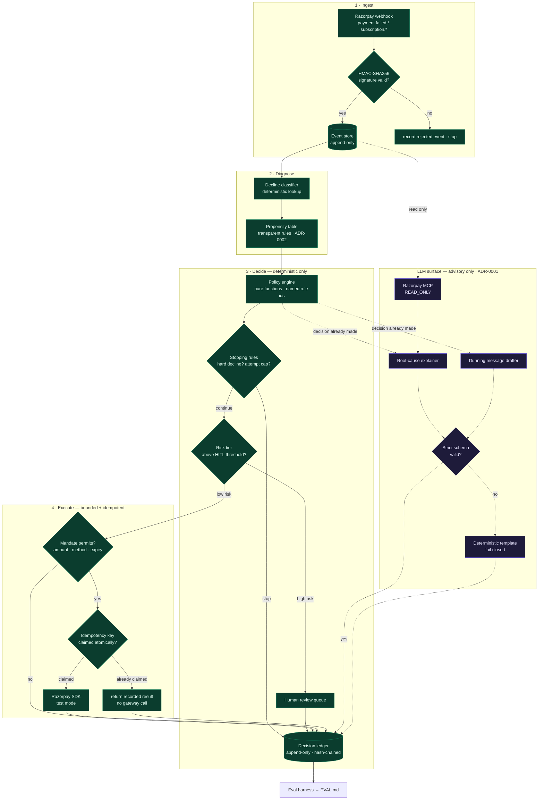

# Architecture

## The one diagram that matters

Solid lines carry money decisions. Dashed lines carry text. **They never cross.**

Read the diagram for one property: **there is no path from the dashed subgraph into
any decision node.** The LLM receives decisions that have already been made and
writes prose about them. That is the whole of ADR-0001, and it is checkable by
looking at the picture.

## Why it is shaped this way

**The agent is a state machine with a few LLM steps, not an LLM with tools.** Money
movement is deterministic and replayable from the event store. LangGraph (Phase 4)
is the orchestration shell around that state machine — checkpointing, conditional
branching, and first-class human-in-the-loop pauses — but the policy engine is a
pure function library that is unit-testable, and runnable, without it. If LangGraph
were removed tomorrow, the recovery logic would survive intact. That is deliberate
insurance.

**Four independent controls, not one clever one.** The LLM containment (ADR-0001),
the mandate envelope (ADR-0003), the human gate (ADR-0003) and the idempotency claim
(ADR-0004) each fail independently. No single mistake produces a wrong debit.

**Writes go through the SDK; MCP is read-only.** MCP exists so a model can call
tools. Our model is not allowed to move money, so routing writes through MCP would
contradict the architecture. The official Razorpay MCP server is mounted READ_ONLY
as an analyst surface: the model can read everything and move nothing.

## Component map

| Module | Responsibility | Phase |
| --- | --- | --- |
| `domain/` | typed vocabulary — actions, decline classes, mandates, outcomes | 0 |
| `generator/profiles.py` | subscription population and failure-mix sampling | 1 |
| `generator/outcome_model.py` | the stochastic world — latent probabilities, common random numbers, oracle | 1 |
| `eval/baselines.py` | do-nothing, retry-once, retry-3x, oracle | 1 |
| `eval/metrics.py` | recovery rate, money, false-action cost, safety invariants, bootstrap CIs | 1 |
| `eval/harness.py` | runs a policy against the world, one outcome per record | 1 |
| `eval/report.py` | renders EVAL.md | 1 |
| `ingest/` | signature-verified webhooks, normalisation | 2 |
| `store/` | append-only event store, hash-chained ledger, idempotency claims | 2 |
| `diagnose/classifier.py` | deterministic decline lookup, ambiguity flagged not guessed | 3 |
| `diagnose/propensity.py` | transparent rule table, every score decomposes into named factors | 3 |
| `diagnose/explainer.py` | advisory LLM narration, fails closed to a template | 3 |
| `diagnose/redact.py` | PII redaction on model output, before storage | 3 |
| `policy/` | rules, stopping rules, mandates, HITL queue, executor | 4 |
| `obs/` | JSONL traces (source of truth), optional Langfuse adapter | 5 |

## Data flow through one failed charge

1. `payment.failed` arrives. Signature verified, appended to the event store.
2. The classifier maps the error tuple to a `DeclineClass`. Ambiguous tuples resolve
   to the most likely class and are flagged as low confidence.
3. The propensity table scores recoverability from class, attempt number, method,
   tenure and history — a named rule fires and its id is recorded.
4. Stopping rules run first: hard decline, attempt cap, expired mandate, or closed
   recovery window all terminate here.
5. Surviving decisions are tiered. High risk goes to the review queue; low risk
   proceeds.
6. The mandate is checked, the idempotency key is claimed atomically, and only then
   is the gateway called.
7. The outcome, the rule id, the propensity, the LLM rationale and the action are
   written as one chained ledger row.
